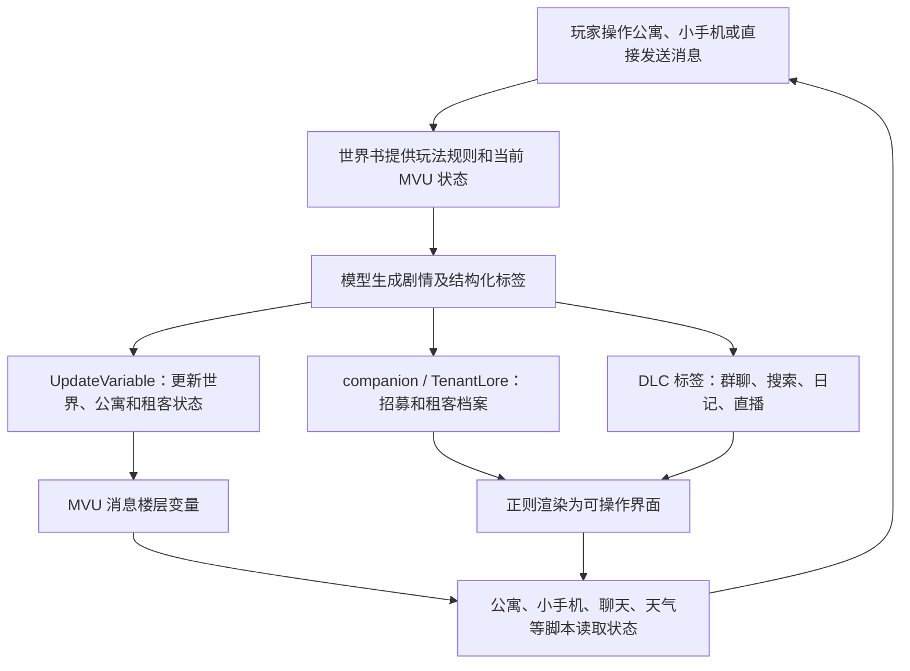

# 房东模拟器 Z5.20 结构全貌

盘点日期：2026-08-08
原始 JSON SHA-256：`260b248d8cad57b413c19126b2f9aca5d0a819a750b325fd5c7f2aa89f3bbda7`

## 一句话结论

“房东模拟器”并不是只有提示词的普通角色卡，而是一套装在 SillyTavern 角色卡中的小型游戏应用：MVU 保存游戏状态，世界书规定玩法，正则脚本负责把模型输出变成界面，酒馆助手脚本提供公寓、小手机、聊天、天气、新闻、地图、音乐和创意工坊等功能。

## 规模

| 组成 | 数量或规模 | 当前状态 |
|---|---:|---|
| 角色卡格式 | Character Card V3 / 3.0 | JSON 有效 |
| 世界书 | 16 条 | 10 条启用、6 条关闭 |
| 酒馆助手脚本 | 30 个 | 23 个启用、7 个关闭 |
| 正则脚本 | 9 个 | 全部启用 |
| 酒馆助手 JavaScript | 35,506 行 / 1,597,610 字节 | 30 个文件均通过语法解析 |
| 已关闭脚本 | 574,920 字节 | 约占全部脚本体积的 36% |
| 模块化工作区 | 137 个文件 | 可以无损重新组装 |
| PNG 内嵌数据 | `chara`、`ccv3` 两份 | 均与独立 JSON 完全一致 |

## 整体运行链路



## 角色文本层

角色卡的 `description`、`personality`、`scenario`、`mes_example`、`system_prompt` 和 `post_history_instructions` 目前都是空的。主要入口集中在：

- `first_mes`：安装要求、玩法教程、故障处理和版本说明。
- 两个备选开场：普通空公寓开局，以及包含 6 名租客和复杂房间的压力测试开局。
- 两个开场都会通过 `<UpdateVariable>` 和 `<JSONPatch>` 初始化或改写 MVU 状态。

这意味着主要提示词压力不在角色基础字段，而在世界书和运行时脚本。

## MVU 状态层

核心数据结构由“变量结构（开）”脚本中的 Zod Schema 定义：

- `世界`：年份、日期、星期、时间。
- `公寓`：楼层列表和房间列表。
- `租客列表`：年龄、外貌、职业、性格、状态、内心和关系。
- `大富翁`：筹码、回合、位置、据点、队伍、道具、监狱回合和最近事件。
- `分基地`：基地描述和住户。

Schema 还检查两项跨字段一致性：房间住户必须存在于租客列表；每个租客必须分配到某个房间。

`[InitVar]` 世界书虽然显示为关闭，但这符合 MVU 初始化条目“勿开”的惯例。开场白随后会用 JSON Patch 写入具体开局时间和测试数据。

## 世界书层

### 当前启用

- `[mvu_update]变量更新规则`：规定时间、公寓、租客和分基地如何更新。
- `[mvu_update]变量输出格式`：要求模型在回复末尾输出 JSON Patch。
- `变量列表`：把当前 MVU 数据提供给模型，但要求模型不要原样展示。
- `关于基建`：房间格子、装修、拆除、入住和住户字段铁则。
- `管理租客档案`：候选人被选择后生成 TenantLore，并等待确认入住。
- `招募租客规则`：根据固定触发语生成 5 名候选人。
- `今日新闻`、`今日天气`：读取小手机脚本写入的变量。
- `世界旅行`：根据玩家选择的地点推动旅行剧情。
- `防全知条目`：禁止 NPC 获知玩家希望隐藏的事情。

### 当前关闭

- `[InitVar]`：供 MVU 读取的初始化数据，关闭属于设计要求。
- `（别开）世界观设定`：默认现代都市与跨时空访客设定，由创意工坊切换。
- DLC1～DLC4：群聊、搜索记录、私人日记和虚拟直播间的生成规则。

DLC 对应的正则渲染仍然启用，因此以后只要开启相应世界书，界面层就已经具备显示能力。

## 酒馆助手脚本层

### 状态与启动

- `MVU zod（开）`：从远程 CDN 加载 MVU 本体。
- `变量结构（开）`：注册房东模拟器的 Zod Schema。

### 公共界面框架

- `悬浮球管理`：统一管理可拖动入口。
- `switcher`：管理脚本组合和预设切换。
- `公寓（开）`：当前公寓建造、房间、租客和关系界面。

### 小手机基础设施

- `小手机主程序`：手机外壳、应用注册、设置和副 API 调用。
- `聊天数据库`：用 IndexedDB 保存聊天记录。
- `分析调度器`：排队执行后台 AI 分析，避免并发冲突。
- `租客分析系统`：分析租客状态并更新 ChatLore。
- `分析队列组件`：显示后台任务进度。
- `聊天核心`：消息收发和副 API 调用。
- `聊天正文联动`：手机聊天、ChatLore 与正文之间同步。
- `聊天APP`：微信式聊天界面。
- `租客档案APP`：查看租客资料和分析状态。
- `提示词/控制台查看器`：调试日志与请求内容。

### 小手机内容应用

- `地图`：本地城市地图界面。
- `音乐`：腾讯音乐搜索、播放和歌词。
- `世界地图`：Leaflet + OpenStreetMap，支持地点搜索和旅行指令。
- `天气APP`：按日期生成天气并写入变量。
- `新闻`：展示小手机主程序生成的新闻。
- `和欧欧聊天吧！`：与租客聊天隔离的独立 OC 聊天。

### 外观与扩展内容

- `美化完整修复版`：页面外观、背景和显示设置。
- `创意工坊main`：本地/云端角色、房间、世界观和表情包管理。

### 已关闭的旧版或候选实现

- `悬浮球示例（别开）`
- `大富翁主脚本`
- `公寓（二改版）`
- `租客分析系统（二改版）`
- `聊天系统（二改版）`
- `音乐（二改版）`
- `报社系统（二改版）`

它们不会正常执行，但仍被完整装在导出的角色卡里，占酒馆助手脚本体积约 36%。

## 正则渲染层

| 正则 | 识别内容 | 作用 |
|---|---|---|
| 对 AI 隐藏状态栏 | `<StatusPlaceHolderImpl/>` | 不把状态栏实现发给模型 |
| 完整变量更新 | `<UpdateVariable>` | 显示变量更新结果 |
| 隐藏变量更新 | `<UpdateVariable>` | 从提示词侧隐藏更新块 |
| 招募租客状态栏 | `<companion>` | 把 5 名候选人渲染为选择界面 |
| 租客档案状态栏 | `<TenantLore>` | 编辑固定档案并加入 ChatLore |
| DLC1 | `<group_chat>` | 群聊记录界面 |
| DLC2 | `<search_history>` | 搜索记录界面 |
| DLC3 | `<diary_entry>` | 私人日记界面 |
| DLC4 | `<live_stream>` | 直播间界面 |

## 数据保存位置

这张卡同时使用四类存储：

1. **MVU 消息楼层变量**：世界、公寓、租客、大富翁和分基地，是主要游戏存档。
2. **SillyTavern 世界书 / ChatLore**：租客固定人设、聊天摘要和创意内容。
3. **浏览器 Local Storage**：界面位置、脚本预设、手机设置、天气、音乐等轻量配置。
4. **浏览器 IndexedDB**：聊天数据库、创意工坊素材和部分外观配置。

因此，“角色卡文件”只是程序本体；真实游玩存档还分散在聊天楼层、世界书和浏览器本地存储中。以后测试升级时必须覆盖旧聊天、刷新页面、换角色卡和导入导出场景。

## 外部依赖

当前启用功能可能访问：

- jsDelivr：MVU 与 Zod 注册工具。
- OpenAI 兼容接口：小手机副 API。
- `workshop-api.chenoo.workers.dev`：创意工坊云端内容。
- OpenStreetMap、Nominatim、Leaflet：世界地图。
- `api.vkeys.cn` 与 QQ 音乐资源：音乐搜索和播放。
- Iconify、Google Fonts、第三方图片与音频 CDN：图标和外观素材。

网络不可用、第三方接口变更或部分地区访问受限时，对应应用可能失效，但不应影响基础剧情与 MVU 存档。

## EJS 使用情况

当前 Z5.20 中没有发现 `<% ... %>`、`<%- ... %>` 或 `@INJECT`，因此实际上没有使用 EJS 提示词模板语法。现有的 `{{getvar::...}}` 和 `{{get_message_variable::...}}` 属于宏/MVU 变量读取，不是 EJS。

EJS 插件可以保留为未来能力，但不应继续被描述为当前版本的强制依赖。

## 已发现、尚未修改的问题

### 高优先级

1. **副 API Key 会被打印到浏览器控制台。** 小手机保存设置时会把整个配置对象写入日志，其中包括 API Key。Key 也以明文保存在 Local Storage。角色卡文件中没有内置 Key，但运行时仍有泄露风险。
2. **MVU 初始化存在竞态。** 当前有 7 个启用脚本直接使用 `Mvu`，却没有各自等待 `waitGlobalInitialized('Mvu')`。首次加载、网络较慢或 CDN 波动时可能偶发白屏、按钮失效或变量读取失败。

### 中优先级

3. **入住流程规则自相矛盾。** `管理租客档案` 前半段规定生成档案时禁止推进时间和描写其他租客，后半段又写“可以推进时间、可以描述互动”，模型可能随机选择其中一套。
4. **启动说明已经过时。** 开场白写的是酒馆助手 4.8.0（2026-02-14），而上游仓库目前已有 4.9.1 标签。
5. **关闭脚本仍占约 36% 的脚本体积。** 它们增加导入、导出、版本比较和人工阅读成本，适合移到仓库归档区，不再装进发布卡。
6. **核心 Schema 使用硬性 `refine/superRefine` 拒绝错误数据。** 这能保护一致性，但一次不完整的 AI 更新可能被整体拒绝，可能就是“租客没有成功入住”类偶发问题的来源之一。
7. **远程脚本没有固定版本。** MVU 和 Zod 工具直接引用不断变化的远程路径，上游更新可能让同一张卡在不同日期表现不同。
8. **外部服务较多。** 音乐、地图、图标、云端创意工坊和副 API 都需要网络，应补充失败状态和降级体验。
9. **防全知条目范围过宽。** 其中包含其他题材的犯罪、暗杀和家庭角色示例，与房东模拟器的日常基调并不完全一致，可能意外改变模型语气或剧情方向。

### 低优先级

10. **开场教程很长且混合了安装、玩法、故障处理和版本信息。** 新玩家容易忽略真正关键的“先建卧室、再招募、最后确认入住”。

## 建议的优化顺序

1. 先处理 API Key 日志和 MVU 启动稳定性。
2. 建立最小自动测试：无租客开局、建房、招募、选择、ChatLore、确认入住、刷新后数据仍在。
3. 合并互相矛盾的世界书规则，缩短开场教程。
4. 把关闭的旧版脚本移出发布卡，留在仓库归档区。
5. 再逐步整理大脚本和外部服务的失败降级，不进行一次性大重写。

## 工作区与构建

- 模块化源码：`角色卡/工作区/Z5.20/`
- 原始基线：`角色卡/原始导出/`
- 重新组装结果：`角色卡/构建产物/房东模拟器Z5.20.json`
- 拆分与构建工具：`tools/card-workspace.mjs`

可使用以下命令：

```bash
npm run card:build
npm run card:check
npm run card:verify-baseline
```
